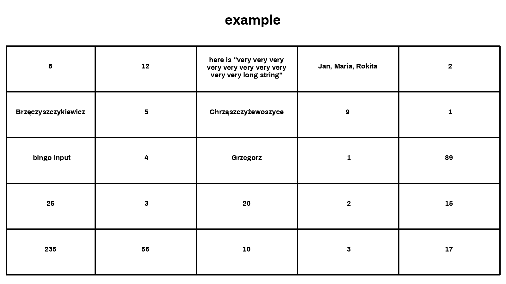

Simple bingo generator written in python.

Just simply install the package using `python -m pip install .`, and use CLI script directly from your shell with `bingo.py`. The first argument goes for title of the bingo, the rest - divided with `##` sequence - are bingo fields.

Sample usage: 

`bingo.py example 0##1##2##3##4##5##6##7##8##9##10##11##12##13##14##15##16##17##18##19##20##21##22##23##24##25##26##27##28##29##30`

will generate following image:

Use `bingo.py --help` for more info.